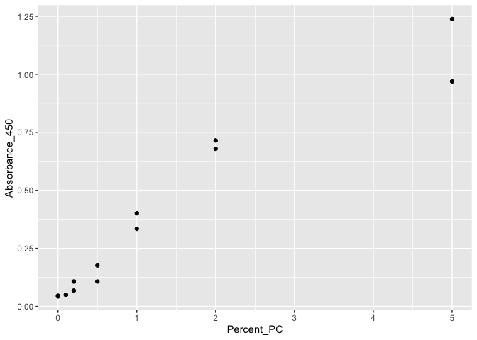
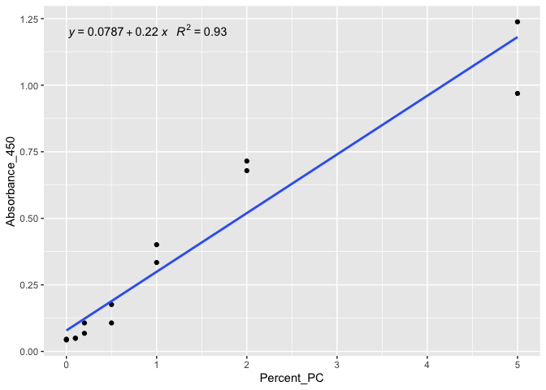
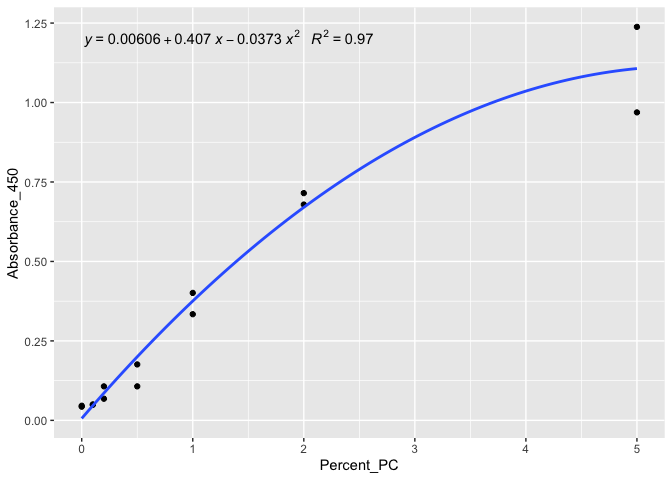
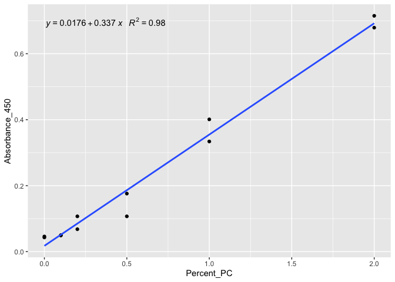

MethylFlash
================
Maggie Schedl
4/6/2021

Load in Libraries

``` r
library(ggplot2)
library(ggpmisc)
```

    ## 
    ## Attaching package: 'ggpmisc'

    ## The following object is masked from 'package:ggplot2':
    ## 
    ##     annotate

Check directory

``` r
getwd()
```

    ## [1] "/Users/maggieschedl/Desktop/URI/Putnam/MESPutnam_Open_Lab_Notebook/rscripts"

### For generating the Standard Curve I went through a couple of options

### I tried 3 types of regression lines. There is a standard linear regression, a quadratic regression (“Use this method when the standard curve is flat due to a saturated signal intensity at high PC%”), and a standard linear regression with the last points (5% PC) removed because the manual says that not all points are necessary: “determine the slope (OD/%) of the standard curve using linear regression and the most linear part (at least 4 concentration points incluing 0) of the standard curve for optimal slope calculation”

### All of the R^2 and significances for the regressions are high/significant so it probably doesn’t matter that much which way we chose to analyze it.

### There is no difference in the slopes of any of the lines if I used the averages of the duplicates, and the slopes are what determine the calculations

Read in duplicate absorbances of the standards

``` r
#read in csv of absorbances
Standards <- read.csv("/Users/maggieschedl/Desktop/URI/Putnam/MESPutnam_Open_Lab_Notebook/csv_files/PC_Standard_Curve.csv")
Standards <- Standards[-c(15), ] # remove row with NA, not sure why it inputs like that
```

Read in csv of the average OD for each sample

``` r
MethylFlashAvgOD <- read.csv("/Users/maggieschedl/Desktop/URI/Putnam/MESPutnam_Open_Lab_Notebook/csv_files/MethylFlash-20210402-Average.csv")
```

Make basic plot of the standards to see what it looks like

``` r
ggplot(Standards, aes(x=Percent_PC, y=Absorbance_450)) + geom_point()
```

<!-- -->
You can see some sort of plateau here at the last points, although there
is a lot of variability there.

# Linear Regression for Duplicate Standards

``` r
ggplot(Standards, aes(x=Percent_PC, y=Absorbance_450)) + geom_point() + geom_smooth(method=lm, se=FALSE) + stat_poly_eq(formula = y ~ x , aes(label = paste(..eq.label.., ..rr.label.., sep = "~~~")), parse = TRUE) 
```

    ## `geom_smooth()` using formula 'y ~ x'

<!-- -->

``` r
# what is the model?
model_lm <- lm(Absorbance_450 ~ Percent_PC, data = Standards)
summary(model_lm) # look at statistics
```

    ## 
    ## Call:
    ## lm(formula = Absorbance_450 ~ Percent_PC, data = Standards)
    ## 
    ## Residuals:
    ##      Min       1Q   Median       3Q      Max 
    ## -0.21194 -0.05153 -0.02428  0.05150  0.19539 
    ## 
    ## Coefficients:
    ##             Estimate Std. Error t value Pr(>|t|)    
    ## (Intercept)  0.07873    0.03637   2.165   0.0513 .  
    ## Percent_PC   0.22044    0.01748  12.611 2.78e-08 ***
    ## ---
    ## Signif. codes:  0 '***' 0.001 '**' 0.01 '*' 0.05 '.' 0.1 ' ' 1
    ## 
    ## Residual standard error: 0.1084 on 12 degrees of freedom
    ## Multiple R-squared:  0.9298, Adjusted R-squared:  0.924 
    ## F-statistic:   159 on 1 and 12 DF,  p-value: 2.777e-08

Using the R^2 and p value, this is a good fit.

Calculation of %5-mC using the linear regression model for duplicate
standards

``` r
# Linear Model Calculation
# Equation is 5-mc% = ((Average Sample OD - Average NC OD)/ (Slope * 100ng)) * 100
AverageNC <- 0.0445 # average OD of negative control 
SlopeLM <- 0.22044 # from linear model

MethylFlashAvgOD$LM_5mc_Percentage <- (((MethylFlashAvgOD$Average_OD-AverageNC)/(SlopeLM * 100))*100)
```

# Second Order Regression or Quadratic Model because the high percentage PC flatten

``` r
# try fitting quadratic model
#create squared variable
Standards$Percent_PC_2 <- Standards$Percent_PC^2
#do model
quadraticModel <- lm(Absorbance_450 ~ Percent_PC + Percent_PC_2, data=Standards)
summary(quadraticModel) # look at statistics
```

    ## 
    ## Call:
    ## lm(formula = Absorbance_450 ~ Percent_PC + Percent_PC_2, data = Standards)
    ## 
    ## Residuals:
    ##       Min        1Q    Median        3Q       Max 
    ## -0.137882 -0.022544  0.006202  0.034087  0.131118 
    ## 
    ## Coefficients:
    ##               Estimate Std. Error t value Pr(>|t|)    
    ## (Intercept)   0.006064   0.029038   0.209   0.8384    
    ## Percent_PC    0.406700   0.045407   8.957  2.2e-06 ***
    ## Percent_PC_2 -0.037307   0.008811  -4.234   0.0014 ** 
    ## ---
    ## Signif. codes:  0 '***' 0.001 '**' 0.01 '*' 0.05 '.' 0.1 ' ' 1
    ## 
    ## Residual standard error: 0.06983 on 11 degrees of freedom
    ## Multiple R-squared:  0.9733, Adjusted R-squared:  0.9685 
    ## F-statistic: 200.6 on 2 and 11 DF,  p-value: 2.208e-09

``` r
# plot
ggplot(Standards, aes(x=Percent_PC, y=Absorbance_450)) + geom_point() + stat_smooth(method = "lm", formula = y ~ x + I(x^2), size = 1, se=FALSE) + stat_poly_eq(formula = y ~ x + I(x^2), aes(label = paste(..eq.label.., ..rr.label.., sep = "~~~")), parse = TRUE)
```

<!-- -->

Calculation of 5mC% using the quadratic model with duplicate standards

``` r
# Equation for quadratic is: Y = aX^2 + bX 
# a and b could also be called Slope1 and Slope2

# Equation is 5-mC% = ((((Slope2^2 + 4Slope1(Average Sample OD - Average NC OD)^0.5) - Slope2 )/2Slope1)/100)*100

Slope1 <- -0.037307
Slope2 <- 0.4067

MethylFlashAvgOD$QU_5mc_Percentage <- (((((Slope2^2+(4*Slope1*(MethylFlashAvgOD$Average_OD-AverageNC)))^.5)-Slope2)/(2*Slope1))/100)*100
```

# Linear Model without 5% PC Standard Point

``` r
# Remove 5% points

Standards_Modified <- Standards[-c(13,14), ] #remove last two rows

ggplot(Standards_Modified, aes(x=Percent_PC, y=Absorbance_450)) + geom_point() + geom_smooth(method=lm, se=FALSE) + stat_poly_eq(formula = y ~ x , aes(label = paste(..eq.label.., ..rr.label.., sep = "~~~")), parse = TRUE) 
```

    ## `geom_smooth()` using formula 'y ~ x'

<!-- -->

``` r
model_lm2 <- lm(Absorbance_450 ~ Percent_PC, data = Standards_Modified)
summary(model_lm2)  
```

    ## 
    ## Call:
    ## lm(formula = Absorbance_450 ~ Percent_PC, data = Standards_Modified)
    ## 
    ## Residuals:
    ##       Min        1Q    Median        3Q       Max 
    ## -0.079275 -0.014201 -0.001851  0.023415  0.046070 
    ## 
    ## Coefficients:
    ##             Estimate Std. Error t value Pr(>|t|)    
    ## (Intercept)  0.01762    0.01346   1.309     0.22    
    ## Percent_PC   0.33731    0.01432  23.548 4.32e-10 ***
    ## ---
    ## Signif. codes:  0 '***' 0.001 '**' 0.01 '*' 0.05 '.' 0.1 ' ' 1
    ## 
    ## Residual standard error: 0.03446 on 10 degrees of freedom
    ## Multiple R-squared:  0.9823, Adjusted R-squared:  0.9805 
    ## F-statistic: 554.5 on 1 and 10 DF,  p-value: 4.324e-10

Calculate 5mC% using the modified linear model using duplicate standards

``` r
# Equation is 5-mc% = ((Average Sample OD - Average NC OD)/ (Slope * 100ng)) * 100
SlopeLM2 <- 0.33731

MethylFlashAvgOD$LM_2__5mc_Percentage <- (((MethylFlashAvgOD$Average_OD-AverageNC)/(SlopeLM2 * 100))*100)
```

Print the 5mC% calculations

``` r
print(MethylFlashAvgOD)
```

    ##    Sample_ID Average_OD LM_5mc_Percentage QU_5mc_Percentage
    ## 1      M-210     0.4730         1.9438396         1.1816958
    ## 2        M-3     0.4190         1.6988750         1.0154052
    ## 3      M-217     0.3980         1.6036110         0.9523965
    ## 4       M-12     0.2290         0.8369624         0.4742860
    ## 5      M-221     0.3490         1.3813283         0.8087009
    ## 6       M-20     0.1125         0.3084740         0.1698456
    ## 7      M-204     0.2305         0.8437670         0.4783273
    ## 8      M-218     0.2140         0.7689167         0.4340513
    ## 9        M-4     0.5380         2.2387044         1.3908841
    ## 10     M-219     0.2700         1.0229541         0.5859583
    ## 11     M-203     0.1865         0.6441662         0.3611137
    ## 12     M-222     0.2240         0.8142805         0.4608384
    ## 13     M-211     0.2650         1.0002722         0.5722029
    ## 14      M-19     0.2285         0.8346942         0.4729396
    ## 15     M-220     0.2415         0.8936672         0.5080651
    ## 16     M-209     0.2640         0.9957358         0.5694564
    ##    LM_2__5mc_Percentage
    ## 1             1.2703448
    ## 2             1.1102547
    ## 3             1.0479974
    ## 4             0.5469746
    ## 5             0.9027304
    ## 6             0.2015950
    ## 7             0.5514215
    ## 8             0.5025051
    ## 9             1.4630459
    ## 10            0.6685245
    ## 11            0.4209777
    ## 12            0.5321514
    ## 13            0.6537013
    ## 14            0.5454923
    ## 15            0.5840325
    ## 16            0.6507367
